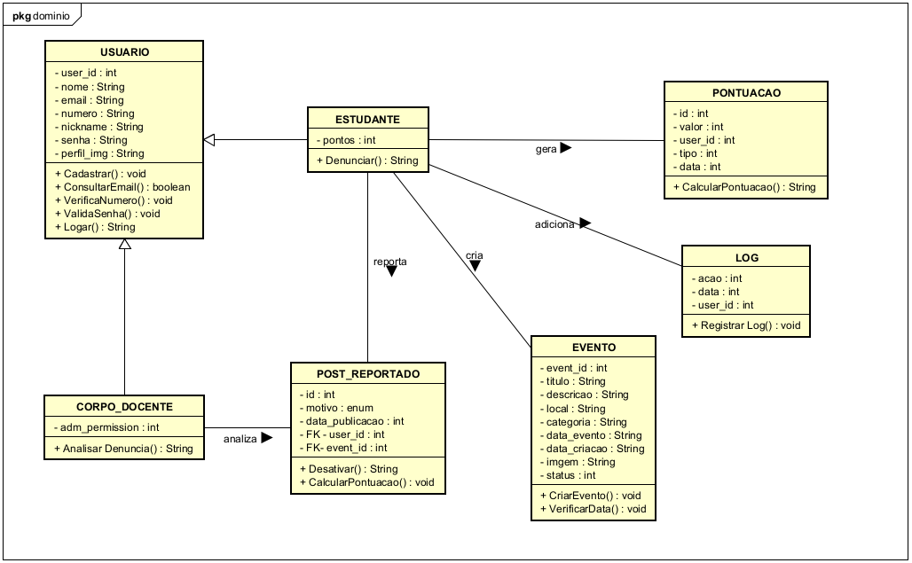
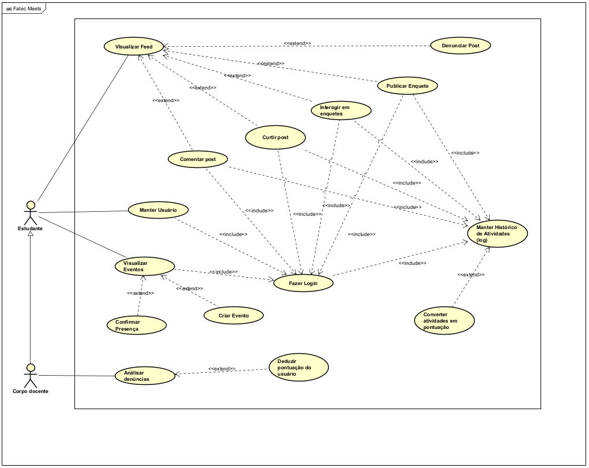
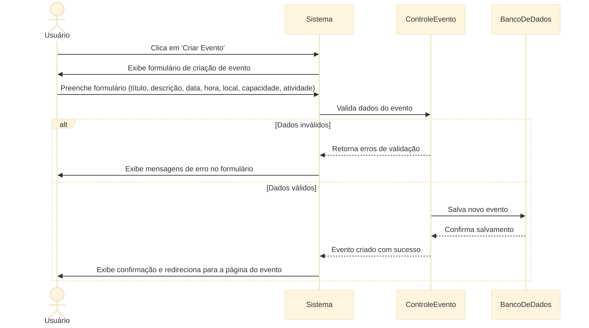
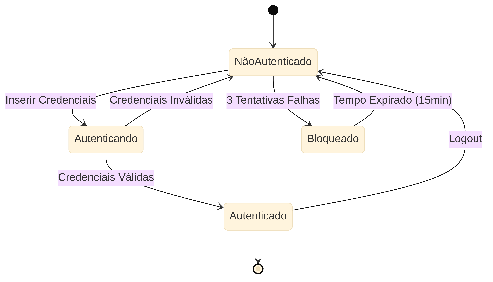
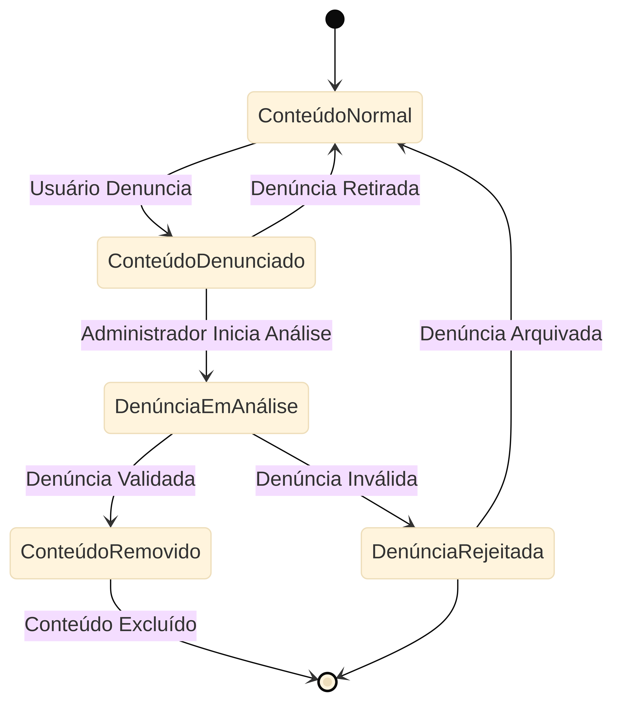

# Meets - Modelagem e Diagramas

## 1. Visao Geral da Modelagem

A modelagem do Meets foi organizada com foco em autenticacao, publicacao, eventos, enquetes, denuncias, logs e pontuacao. Os diagramas mostram o comportamento do sistema e a estrutura conceitual usada no projeto.

## 2. Modelo de Dominio

O modelo de dominio apoia a estrutura central do sistema e destaca as entidades mais importantes para a plataforma.

## 3. Modelo Conceitual

O modelo conceitual organiza as entidades e seus relacionamentos, servindo como base para a definicao do banco de dados e da estrutura de classes.

## 4. Diagrama de Caso de Uso

O caso de uso geral sintetiza a interacao entre estudante e corpo docente com as principais funcionalidades do sistema.

## 5. Diagramas de Atividade

Os diagramas de atividade registram os fluxos de cadastro e publicacao, reforcando a validacao de dados e a persistencia no sistema.

## 6. Diagramas de Sequencia

Os diagramas de sequencia mostram a interacao entre usuario, sistema e persistencia durante operacoes centrais.

## 7. Diagramas de Estado

Os diagramas de maquina de estados ajudam a representar o ciclo de vida de algumas entidades e suas transicoes principais.

## 8. Complementos de Modelagem

Os arquivos originais de diagramas continuam no repositorio para edicao, mas esta pasta centraliza as imagens exportadas usadas pela documentacao em Markdown.