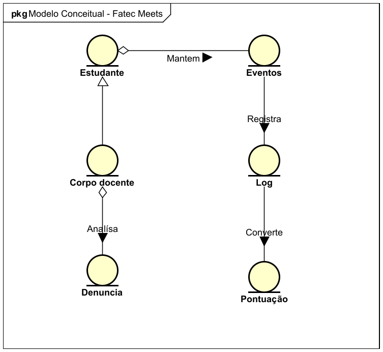

# Projeto Meets - Requisitos do Sistema

## 1. Objetivo

Registrar os requisitos funcionais, nao funcionais e regras de negocio do sistema Meets, mantendo a relacao entre o comportamento esperado e a documentacao UML.

## 2. Tecnicas Utilizadas na Elicitacao de Requisitos

Os requisitos podem ser derivados a partir da analise dos diagramas, da observacao dos fluxos de negocio e da modelagem das interacoes principais do sistema.

## 3. Requisitos Funcionais

### Grupo: Autenticacao

- RF01 - Cadastrar usuario.
- RF02 - Realizar login com e-mail e senha.
- RF03 - Recuperar acesso de usuario, quando aplicavel.

### Grupo: Conteudo

- RF04 - Visualizar feed.
- RF05 - Publicar post.
- RF06 - Comentar post.
- RF07 - Curtir post.
- RF08 - Denunciar post.

### Grupo: Eventos e Enquetes

- RF09 - Criar evento.
- RF10 - Visualizar eventos.
- RF11 - Confirmar presenca em evento.
- RF12 - Publicar enquete.
- RF13 - Interagir em enquete.

### Grupo: Controle e Moderacao

- RF14 - Registrar historico de atividades.
- RF15 - Converter atividades em pontuacao.
- RF16 - Analisar denuncias.
- RF17 - Deduzir pontuacao em caso de denuncia procedente.

## 4. Requisitos Nao Funcionais

### Grupo: Qualidade e Estrutura

- RNF01 - O sistema deve ser desenvolvido com arquitetura orientada a objetos.
- RNF02 - A documentacao deve permanecer consistente com a implementacao.
- RNF03 - O sistema deve utilizar persistencia em banco de dados.

### Grupo: Usabilidade e Seguranca

- RNF04 - O sistema deve exibir mensagens claras de erro e validacao.
- RNF05 - O sistema deve permitir acesso apenas a usuarios autenticados nas funcionalidades restritas.
- RNF06 - O sistema deve manter rastreabilidade das acoes executadas.

### Grupo: Operacao

- RNF07 - O sistema deve funcionar de forma adequada para o uso previsto no contexto academico.
- RNF08 - A solucao deve manter consistencia entre os dados exibidos e os dados persistidos.

## 5. Regras de Negocio

- RN01 - O e-mail deve ser unico no cadastro.
- RN02 - O cadastro somente deve ser concluido com todos os campos obrigatorios preenchidos.
- RN03 - Apenas usuarios autenticados podem interagir com o feed.
- RN04 - Apenas o corpo docente pode analisar denuncias.
- RN05 - Toda acao relevante deve gerar log.
- RN06 - A pontuacao deve ser atualizada conforme o comportamento do usuario.
- RN07 - Denuncias procedentes podem reduzir a pontuacao do responsavel.
- RN08 - Eventos devem possuir dados obrigatorios antes da publicacao.

## 6. Matriz de Relacionamento RN x RF

| RN / RF | RF01 | RF02 | RF03 | RF04 | RF05 | RF06 | RF07 | RF08 | RF09 | RF10 | RF11 | RF12 | RF13 | RF14 | RF15 | RF16 | RF17 |
| --- | --- | --- | --- | --- | --- | --- | --- | --- | --- | --- | --- | --- | --- | --- | --- | --- | --- |
| RN01 | X |  |  |  |  |  |  |  |  |  |  |  |  |  |  |  |  |
| RN02 | X |  |  |  |  |  |  |  |  |  |  |  |  |  |  |  |  |
| RN03 |  | X |  | X | X | X | X | X |  |  |  |  |  | X | X | X | X |
| RN04 |  |  |  |  |  |  |  | X |  |  |  |  | X |  |  | X | X |
| RN05 |  | X |  | X | X | X | X | X | X | X | X | X | X | X | X | X | X |
| RN06 |  |  |  | X | X | X | X | X | X |  |  |  |  | X | X | X | X |
| RN07 |  |  |  | X | X | X | X | X | X |  |  |  | X | X | X | X | X |
| RN08 |  |  |  |  |  |  |  |  |  | X | X |  | X |  |  | X | X |

## 7. Referencia Visual

