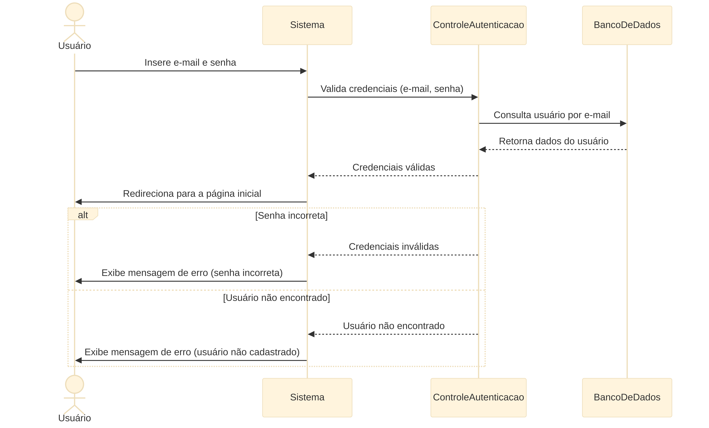

# Projeto Meets - Casos de Uso

## 1. Objetivo

Especificar os principais casos de uso do sistema Meets com base nos fluxos identificados nos diagramas do projeto.

## 2. Atores do Sistema

- Estudante
- Corpo docente

## 3. Diagrama de Casos de Uso

Os casos de uso principais do sistema sao:

- Fazer login
- Cadastrar usuario
- Visualizar feed
- Publicar post
- Comentar post
- Curtir post
- Denunciar post
- Visualizar eventos
- Criar evento
- Confirmar presenca
- Publicar enquete
- Interagir em enquete
- Analisar denuncias
- Manter historico de atividades

## 4. Especificacao dos Casos de Uso

### Caso de uso #001 - Fazer Login

Descricao: autenticar o usuario no sistema.

Tipo: conducao.

Atores que iniciam: estudante.

Pre-condicoes: usuario cadastrado no sistema.

Pos-condicoes: usuario autenticado e redirecionado para a pagina inicial.

Entradas: e-mail e senha.

Saidas: acesso liberado ou mensagem de erro.

Fluxo principal:

1. O usuario informa e-mail e senha.
2. O sistema valida as credenciais.
3. O sistema consulta os dados no banco.
4. O sistema confirma a autenticacao.
5. O sistema redireciona o usuario.

Fluxo alternativo 1: senha incorreta

1. O sistema identifica que a senha esta incorreta.
2. O sistema exibe mensagem de erro.

Fluxo alternativo 2: usuario nao encontrado

1. O sistema identifica que o usuario nao existe.
2. O sistema exibe mensagem de erro.

### Caso de uso #002 - Cadastrar Usuario

Descricao: permitir o cadastro de um novo usuario.

Tipo: conducao.

Atores que iniciam: estudante.

Pre-condicoes: usuario nao cadastrado.

Pos-condicoes: novo usuario registrado no sistema.

Entradas: nome, e-mail, senha e demais dados cadastrais.

Saidas: confirmacao de cadastro ou mensagem de erro.

Fluxo principal:

1. O usuario preenche o formulario de cadastro.
2. O sistema valida os campos obrigatorios.
3. O sistema verifica se o e-mail ja esta em uso.
4. O sistema valida a senha.
5. O sistema grava o cadastro.
6. O sistema confirma o sucesso.

Fluxo alternativo 1: campos obrigatorios vazios

1. O sistema identifica campos nao preenchidos.
2. O sistema exibe mensagem de erro.

Fluxo alternativo 2: e-mail em uso

1. O sistema identifica e-mail duplicado.
2. O sistema exibe mensagem de e-mail em uso.

### Caso de uso #003 - Publicar Post

Descricao: permitir a publicacao de um novo post no feed.

Tipo: conducao.

Atores que iniciam: estudante.

Pre-condicoes: usuario autenticado.

Pos-condicoes: post armazenado e exibido no feed.

Entradas: titulo, descricao, imagem e demais dados do post.

Saidas: confirmacao de publicacao ou mensagem de erro.

Fluxo principal:

1. O usuario seleciona a opcao de publicar post.
2. O sistema exibe o formulario.
3. O usuario preenche os dados.
4. O sistema valida as informacoes.
5. O sistema envia os dados ao controle de publicacao.
6. O sistema armazena o post.
7. O sistema exibe o post no feed.

Fluxo alternativo 1: dados obrigatorios ausentes

1. O sistema identifica inconsistencias.
2. O sistema exibe mensagem de erro.

Fluxo alternativo 2: dados invalidos

1. O sistema identifica informacoes invalidas.
2. O sistema solicita correcao.

### Caso de uso #004 - Denunciar Post

Descricao: registrar uma denuncia de conteudo.

Tipo: conducao.

Atores que iniciam: estudante.

Pre-condicoes: usuario autenticado e post disponivel.

Pos-condicoes: denuncia registrada para analise.

Entradas: motivo da denuncia e identificacao do post.

Saidas: confirmacao de denuncia registrada.

Fluxo principal:

1. O usuario seleciona denunciar post.
2. O sistema solicita o motivo.
3. O usuario informa o motivo.
4. O sistema registra o post reportado.
5. O sistema encaminha a denuncia para analise.

### Caso de uso #005 - Analisar Denuncias

Descricao: permitir a analise de denuncias pelo corpo docente.

Tipo: analise.

Atores que iniciam: corpo docente.

Pre-condicoes: existir denuncia pendente.

Pos-condicoes: denuncia tratada e situacao do post atualizada.

Entradas: denuncia selecionada e parecer da analise.

Saidas: decisao de manutencao, bloqueio ou ajuste de pontuacao.

Fluxo principal:

1. O docente acessa as denuncias pendentes.
2. O sistema exibe os registros.
3. O docente analisa o conteudo denunciado.
4. O sistema registra a decisao.
5. Se necessario, o sistema ajusta a pontuacao do usuario.
